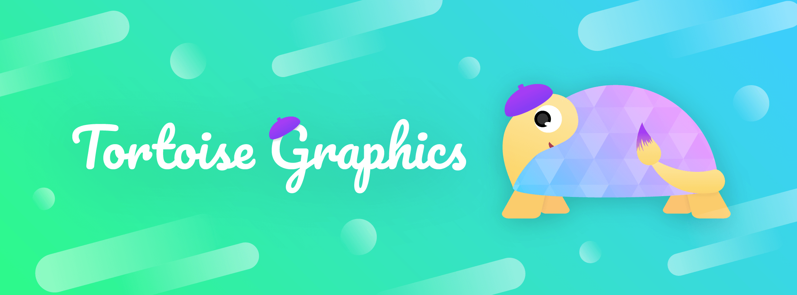

# TortoiseGraphics2

[](https://swift.org)
[](https://swift.org/package-manager)
[](LICENSE)
[]()
[](https://temoki.github.io/TortoiseGraphics2/)

A [turtle graphics](https://en.wikipedia.org/wiki/Turtle_graphics) engine — a key feature of the [Logo](https://en.wikipedia.org/wiki/Logo_(programming_language)) programming language — written in Swift.

> **Version 2** of [TortoiseGraphics](https://github.com/temoki/TortoiseGraphics), rewritten for Swift 6 strict concurrency and SwiftUI.

```swift
let 🐢 = Tortoise()
🐢.penColor = .orange
🐢.penWidth = 2
for _ in 1...36 {
    🐢.forward(200)
    🐢.right(170)
}
```


## Modules

| Module | Description |
|--------|-------------|
| **TortoiseCore** | Tortoise API + command stream. Foundation-only; no platform dependencies. |
| **TortoiseUI** | SwiftUI animated canvas view (`TimelineView` + `Canvas`). |
| **TortoiseSVG** | Tortoise → static SVG string. No platform dependencies. |

The design follows an event-sourcing pattern: `Tortoise` accumulates
`[TortoiseCommand]`; rendering is handled by separate, pure-function
consumers that replay the same stream. This makes SVG export, animation,
and testing all share a single source of truth.

## Requirements

- **Swift** 6.2+
- **Xcode** 26+
- **Platforms** iOS 26+ · macOS 26+ · visionOS 26+

## Installation

Add the package in Xcode via **File › Add Package Dependencies**, or add it
to your `Package.swift`:

```swift
dependencies: [
    .package(url: "https://github.com/temoki/TortoiseGraphics", from: "2.0.0"),
],
targets: [
    .target(
        name: "YourTarget",
        dependencies: [
            .product(name: "TortoiseCore", package: "TortoiseGraphics"),
            .product(name: "TortoiseUI",   package: "TortoiseGraphics"),
            .product(name: "TortoiseSVG",  package: "TortoiseGraphics"),
        ]
    ),
]
```

Import only what you need — `TortoiseCore` alone is sufficient if you're
writing your own renderer.

## Usage

### Animated SwiftUI view


```swift
import TortoiseUI

struct ContentView: View {
    var body: some View {
        TortoiseCanvas { 🐢 in
            🐢.speed = 5
            🐢.penColor = .blue
            for _ in 1...4 {
                🐢.forward(100)
                🐢.right(90)
            }
        }
    }
}
```

`speed` ranges from 1 (slowest) to 10 (fastest). Set it to `0` for instant
rendering — useful for static previews.

### SVG export

```swift
import TortoiseSVG

let 🐢 = Tortoise()
🐢.penColor = .blue
for _ in 1...4 {
    🐢.forward(100)
    🐢.right(90)
}

let svg = TortoiseSVG.render(🐢)
// or:
let svg = 🐢.svg()

// Write to a file using Swift's built-in String method
try svg.write(to: URL(filePath: "square.svg"), atomically: true, encoding: .utf8)
```

### Tortoise API quick reference

#### Movement

| Method / Property | Description |
|---|---|
| `forward(_ distance: Double)` | Move forward by `distance` pixels |
| `backward(_ distance: Double)` | Move backward by `distance` pixels |
| `right(_ degrees: Double)` | Rotate clockwise |
| `left(_ degrees: Double)` | Rotate counterclockwise |
| `home()` | Teleport to origin and reset heading to north |
| `setPosition(x:y:)` / `setPosition(_:)` | Teleport to a position (pen draws if down) |
| `setX(_ x: Double)` | Teleport to `(x, y)` keeping current Y |
| `setY(_ y: Double)` | Teleport to `(x, y)` keeping current X |
| `circle(radius:extent:)` | Draw a circular arc (default `extent`: 360°) |
| `dot(size:)` | Draw a filled circle at the current position |

#### Pen

| Method / Property | Description |
|---|---|
| `penDown()` | Lower pen — movements draw lines |
| `penUp()` | Lift pen — movements don't draw |
| `isPenDown: Bool` | Whether the pen is currently down (read-only) |
| `penColor: Color` | Stroke color |
| `penWidth: Double` | Stroke width in logical units |

#### Fill

| Method / Property | Description |
|---|---|
| `beginFill()` | Start collecting fill polygon vertices |
| `endFill()` | Close and draw the fill polygon |
| `fillColor: Color` | Fill color |
| `isFilling: Bool` | Whether a fill region is currently active (read-only) |

#### Query

| Method / Property | Description |
|---|---|
| `position: Point` | Current position in tortoise coordinates (read-only) |
| `heading: Double` | Current heading in degrees (0 = north, CW+); settable |
| `towards(x:y:)` / `towards(_:)` | Heading toward a point from current position |
| `distance(x:y:)` / `distance(_:)` | Distance to a point from current position |

#### Appearance

| Method / Property | Description |
|---|---|
| `showTortoise()` | Make the tortoise visible |
| `hideTortoise()` | Hide the tortoise |
| `isVisible: Bool` | Whether the tortoise is visible (read-only) |

#### Canvas

| Method / Property | Description |
|---|---|
| `backgroundColor: Color` | Canvas background color |
| `clear()` | Erase all drawings (tortoise state is preserved) |
| `speed: Double` | Animation speed: 1 (slowest) … 10 (fastest), 0 = instant |
| `canvasSize: Size` | Logical canvas dimensions |

#### Viewport (TortoiseCanvas)

Use the `.tortoiseViewport(_:)` modifier to control how the drawing maps onto the view:

```swift
TortoiseCanvas(🐢)
```

| `ViewportMode` | Description |
|---|---|
| `.scaleToFit` | Scale logical canvas to fill the view, letterboxed. |
| `.original` | 1 tortoise unit = 1 point, origin at view center |
| `.autoFit` | Scale and center to fit the actual drawing bounding box. **Default.** |

## Architecture

```
Tortoise API calls
      │  produces
      ▼
[TortoiseCommand]  ── pure value stream ──▶  TortoiseUI  (SwiftUI animation)
  (Sendable)                           ──▶  TortoiseSVG (static SVG export)
                                       ──▶  your own renderer
```

`CommandPlayer.play(commands:)` converts `[TortoiseCommand]` into
`[PlaybackFrame]` — a snapshot of tortoise state after each command. Both
`TortoiseUI` and `TortoiseSVG` build on top of this pure function.

## Credits

* Special thanks to [@kiyoshifuwa](https://twitter.com/kiyoshifuwa), for the amazing art works.

## License

MIT. See [LICENSE](LICENSE).
